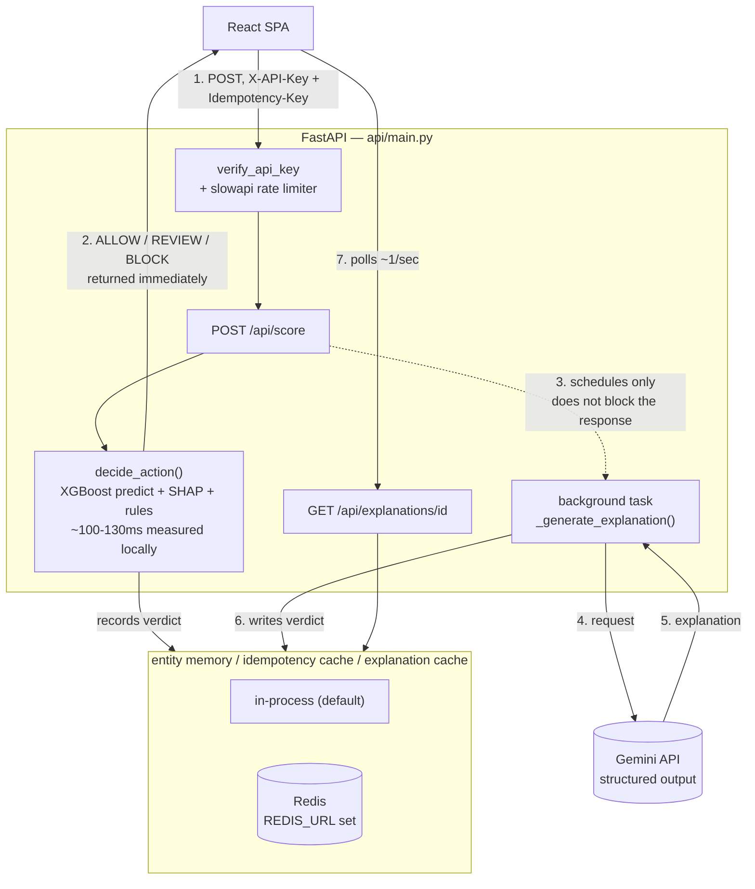

# AI Risk Manager — Razorpay Buildathon (Track 2)

An entity-aware transaction risk system: an XGBoost model scores each
transaction, SHAP explains which signals drove the score, and a
**Gemini-powered LLM agent** (via the Google Gen AI API, free tier)
reasons over both the transaction and the entity's (card/account)
recent risk trajectory to produce a human-readable explanation — with
the threshold itself chosen to minimize business cost, not just
maximize accuracy.

## Why this is different from a standard fraud classifier

Most fraud-detection submissions stop at: train a classifier, wrap it
in SHAP, done. This project makes several deliberate additions, each
solving a real gap in that standard approach:

1. **Entity risk memory (the "agentic" piece).** Transactions aren't
   scored in isolation. Each card/account fingerprint (`entity_id`) has
   a rolling verdict history; three or more REVIEW/BLOCK verdicts in
   its recent window pushes it into a `WATCH` or `ELEVATED` escalation
   state. The LLM agent is given this state explicitly and can escalate
   its recommended action beyond what the raw score alone suggests —
   and must say so, rather than silently overriding the model. See
   `src/entity_memory.py`.

2. **Cost-optimal threshold, not just AUC — and not just one point
   estimate.** A risk team doesn't optimize accuracy — they minimize
   expected cost, where missed fraud and wrongly-blocked legitimate
   customers have very different costs. `src/cost_analysis.py` sweeps
   thresholds and picks the one that minimizes `false_negatives *
   avg_fraud_loss + false_positives * avg_fp_cost`, and reports the
   estimated savings vs. a naive 0.5 threshold. The cost assumptions
   are explicit, adjustable constants, not hidden inside a single
   "accuracy" number — and `threshold_sensitivity()` goes a step
   further, sweeping a grid of *plausible* cost assumptions (0.5x-2x
   the defaults) so the "optimal" threshold is reported as a range,
   not a single number staked on guessing two constants exactly right.
   See [Does the cost-optimal threshold hold up under different cost
   assumptions?](#does-the-cost-optimal-threshold-hold-up-under-different-cost-assumptions)

3. **Structured LLM output, not scraped JSON.** `src/llm_agent.py` calls
   Gemini (`gemini-3.6-flash`) through the Google Gen AI SDK's
   structured outputs (`response_schema=RiskVerdict`, a Pydantic model,
   read back via `response.parsed`), so the action is schema-constrained
   to `ALLOW`/`REVIEW`/`BLOCK` at generation time rather than hoping the
   model's free-text JSON parses. Untrusted transaction fields (email
   domain, product code, etc.) are sanitized before being interpolated
   into the prompt, and the system prompt explicitly instructs the
   model to treat them as data, never as instructions — a basic
   prompt-injection defense, since those fields ultimately trace back
   to attacker-controlled transaction data.

4. **The LLM is never on the authorization critical path.** `POST
   /api/score` makes the ALLOW/REVIEW/BLOCK decision synchronously from
   the score and a deterministic rule table (`decide_action` in
   `api/main.py`) and returns immediately — this is what actually gates
   the transaction. Measured locally on CPU, that decision path (XGBoost
   predict + SHAP + rules) takes ~100-130ms; the Gemini API call it
   *doesn't* wait on adds real network + generation latency on top of
   that (and free-tier requests can additionally queue behind a rate
   limit). The LLM runs afterward as a FastAPI background task purely to
   generate a human-readable explanation for the reviewer queue; the
   frontend polls `GET /api/explanations/{verdict_id}` for it. A
   real-time payment authorization path can't block on an LLM API call
   (latency, and a rate limit or outage on the vendor's side
   shouldn't take down transaction authorization), so this mirrors how
   such systems are actually built — decision first, explanation
   enrichment after.

5. **Idempotency on the scoring endpoint.** `POST /api/score` accepts an
   optional `Idempotency-Key` header (the same convention Razorpay's own
   API asks integrators to use). A retried request with the same key
   returns the original cached response instead of re-scoring — without
   this, a network retry or a double-submit would score the same
   transaction twice and double-count it in the entity's escalation
   history, incorrectly pushing them toward `WATCH`/`ELEVATED`.

6. **Optional Redis-backed state, same behavior either way.** Entity
   escalation history, the idempotency cache, and pending/ready
   explanations all live in-process by default (session-scoped, zero
   setup — the right default for local dev/demo). Set `REDIS_URL` and
   the exact same classes (`RedisEntityRiskMemory`, `KeyedCache` in
   `src/entity_memory.py` / `src/redis_utils.py`) back the same state
   with Redis instead — surviving restarts and shareable across
   workers — with no behavior change for the caller. `tests/` runs the
   *same* test suite against both backends (via a parametrized fixture,
   not separate test files) to prove they actually agree, not just that
   each one individually "works."

7. **Rate limiting on the expensive endpoint.** `POST /api/score` is
   capped at 30 requests/minute per caller (`X-API-Key` if present,
   else source IP) via `slowapi` — a fraud-scoring endpoint that calls
   an ML model and (asynchronously) an LLM shouldn't be able to be
   hammered with no limit. Cheap read routes (`/api/entities`, etc.)
   are deliberately not subject to this budget.

8. **A human review queue that closes the feedback loop.** A model's
   score isn't the end of a real fraud pipeline — a human disposing a
   prioritized queue, and that disposition feeding back into the system,
   is. Every REVIEW/BLOCK verdict lands in `src/review_queue.py`
   (same REDIS_URL-optional design as entity memory); a reviewer marks
   each one `CONFIRMED_FRAUD` or `FALSE_POSITIVE` in the frontend's
   Review Queue tab (`POST /api/review-queue/{verdict_id}/disposition`,
   `409` on a repeat disposition so a retry can't silently overwrite a
   reviewer's call). `GET /api/review-queue/metrics` then recomputes
   [Phase 0's escalation-ablation comparison](#does-entity-escalation-actually-help)
   from these *live* dispositions — precision specifically among
   escalation-triggered flags vs. non-escalated ones — instead of only
   the offline test set.

## A note on the dataset and the entity fingerprint

IEEE-CIS is a genuinely anonymized dataset — it deliberately does not
ship a raw account/merchant ID. `src/data_utils.py` builds a proxy
entity fingerprint from `card1 + card2 + card5 + addr1 +
P_emaildomain`. This is the well-known "UID" technique used in several
top-performing solutions to the original Kaggle competition, not
something invented for this project — it mirrors how real card
networks do entity resolution (device + card + address fingerprinting)
when no explicit account ID is available in the event stream. With
real Razorpay data, you'd use the actual merchant/account ID directly.

## Setup

```bash
pip install -r requirements.txt        # runtime only
pip install -r requirements-dev.txt    # + pytest, fakeredis, etc. — includes requirements.txt
```

Both files are pinned to exact versions (`pip freeze`-style, hand-trimmed
to what's actually imported) for reproducible installs.

### 1. Get the data

This is a **Kaggle competition** dataset — you must join the
competition once (free, one click) before the API will let you
download it:
https://www.kaggle.com/competitions/ieee-fraud-detection

Then, with Kaggle API credentials configured (`~/.kaggle/kaggle.json`
or `KAGGLE_USERNAME`/`KAGGLE_KEY` env vars):

```bash
python src/download_data.py
```

This places `train_transaction.csv` and `train_identity.csv` in `data/`.

### 2. Set your API keys

Copy the example env file and fill it in:

```bash
cp .env.example .env
```

- **`API_KEY`** — required for every `/api/*` route except `/api/health`.
  There's no default: if unset, the API rejects every request with 401
  (fail closed) rather than being left open. Generate one yourself:
  ```bash
  python -c "import secrets; print(secrets.token_urlsafe(32))"
  ```
- **`GEMINI_API_KEY`** — free key from
  [aistudio.google.com/apikey](https://aistudio.google.com/apikey), no
  billing required (rate-limited). Without this set, `/api/score` still
  returns the instant ALLOW/REVIEW/BLOCK decision (see point 4 above) —
  only the AI explanation panel falls back to a "credentials missing"
  message.

The backend doesn't auto-load `.env` on its own — either export the
values into your shell, or run uvicorn with `--env-file .env` (requires
`python-dotenv`, not currently a dependency):

```bash
export API_KEY=...          # macOS/Linux
export GEMINI_API_KEY=...
```
```powershell
$env:API_KEY = "..."        # Windows PowerShell, current session
$env:GEMINI_API_KEY = "..."
setx API_KEY "..."          # Windows PowerShell, permanent (needs a new terminal to take effect)
setx GEMINI_API_KEY "..."
```

### 3. Train the model

```bash
python src/train_model.py
```

Writes `models/risk_model.joblib`, `models/feature_cols.joblib`,
`models/optimal_threshold.joblib`, and `models/eval_report.txt`
(AUC/PR-AUC plus the cost-based threshold analysis — this is what
you'll quote in the pitch).

### 4. Launch the API backend

```bash
uvicorn api.main:app --reload --port 8000
```

This serves the scoring/explanation/cost-analysis logic as a JSON API
at `http://localhost:8000/api/...`.

**First run is slow, and that's expected:** importing pandas/xgboost/shap
takes ~20-30s before the server is even listening, and the very first
`/api/entities` request loads and feature-engineers the full ~590K-row
CSV (a couple of minutes) before caching the small sample it actually
serves to `models/sample_data_cache.pkl`. Every request after that —
including future restarts, as long as that cache file exists — is fast
(well under a second). Don't open the frontend until the backend
terminal prints `Application startup complete.`, or you'll see
connection errors that look like a bug but are really just "not ready
yet."

### 5. Launch the frontend

```bash
cd frontend
cp .env.example .env   # set VITE_API_KEY to the same value as the backend's API_KEY
npm install
npm run dev
```

Opens the app at `http://localhost:5173` (Vite dev server proxies
`/api/*` to the backend on port 8000 — see `frontend/vite.config.ts`).
Vite loads `.env` automatically — no export/shell step needed here,
unlike the backend. If `VITE_API_KEY` doesn't match the backend's
`API_KEY` exactly, every request the UI makes will 401.
For a production build: `npm run build` (outputs static assets to
`frontend/dist/`), served by any static host or reverse-proxied behind
the FastAPI backend.

**Live Scoring tab:** pick an entity, walk through its transactions in
sequence, and watch the escalation state build up as verdicts
accumulate — this is the part to demo live, since it's the piece a
static classifier genuinely can't do. The automated decision (action +
escalation flag) appears instantly; the "AI Reviewer Explanation" panel
below it fills in a moment later once the background LLM call finishes
— that gap is intentional, not a loading bug (see point 4 above).

**Cost-Optimal Threshold tab:** shows the eval report and lets you
adjust the fraud-loss/false-positive-cost assumptions to see how the
optimal threshold shifts.

### Docker (alternative to steps 4-5)

Runs the backend, frontend, and Redis together — requires `models/`
already populated (step 3) and `.env` set up (step 2):

```bash
docker compose up --build
```

Backend: `http://localhost:8000` · Frontend: `http://localhost:5173`
(nginx, reverse-proxying `/api/*` to the backend container — see
`frontend/nginx.conf`). Redis is wired in automatically
(`REDIS_URL=redis://redis:6379/0`), so entity escalation state and the
idempotency cache survive `docker compose restart backend`.

One gotcha specific to the frontend image: `VITE_API_KEY` has to be a
**build** arg, not a container `environment:` entry — Vite bakes
`import.meta.env.VITE_*` into the static JS bundle at `npm run build`
time, before the container ever runs (see `frontend/Dockerfile`'s
comment). `docker-compose.yml` already wires this correctly via
`build.args`; it's only a trap if you build the frontend image by hand.

### Running tests

```bash
pytest                                    # run everything
pytest --cov=src --cov=api --cov-report=term-missing   # with coverage
```

Runs clean with **no trained model, no Kaggle dataset, no `API_KEY`, no
`GEMINI_API_KEY`, and no real Redis** — every module's tests either
exercise pure logic directly or fake out the one thing that needs real
credentials/data/infra (`tests/conftest.py`'s `client` fixture fakes
`get_sample_data`, `get_explainer`, and `get_agent`; `test_llm_agent.py`
mocks the Gemini client; `test_entity_memory.py` and `test_keyed_cache.py`
use `fakeredis` for the Redis-backed paths).

- `test_entity_memory.py` — WATCH/ELEVATED threshold crossing, the
  rolling-window eviction, single-vs-all `reset()` — **parametrized to
  run the identical suite against both `EntityRiskMemory` (in-process)
  and `RedisEntityRiskMemory` (fakeredis)**, proving they actually agree
  rather than each just passing its own tests.
- `test_keyed_cache.py` — same parametrized-against-both-backends
  approach, for the cache class the idempotency store and explanation
  store are both built on.
- `test_rate_limit.py` — fires 31 requests at `/api/score` in a loop and
  asserts the 31st gets 429; confirms other routes aren't subject to
  the same budget.
- `test_cost_analysis.py` — a hand-computable fraud/legit example, so
  `cost_curve`'s fn/fp/tp counts and `optimal_threshold`'s savings math
  are checked against numbers worked out by hand, not just "doesn't crash."
- `test_data_utils.py` — the **leakage-prevention test that matters
  most**: asserts `add_causal_entity_history` computes each row's prior
  fraud rate using only strictly-earlier transactions for that entity —
  written so it would fail if the causal shift were ever accidentally
  removed (verified by hand against a broken variant while writing it).
- `test_risk_explainer.py` — trains a tiny real XGBoost model as a
  fixture (not the 590K-row CSVs) and includes a regression test for the
  single-row categorical-dtype bug described in the module's own docstring.
- `test_api.py` / `test_api_auth.py` — every route via FastAPI's
  `TestClient`: happy paths, 400/404s, the `Idempotency-Key` dedup
  behavior (same key → identical response, verdict recorded once, not
  twice), the auth dependency (401 without/with-wrong key, fail-closed
  when `API_KEY` itself is unset), and a regression test proving a crash
  inside the background explanation task resolves to a safe fallback
  instead of leaving the frontend polling "pending" forever.
- `test_llm_agent.py` — prompt-injection sanitization and every Gemini
  failure path (missing/invalid key, rate limiting, server errors,
  malformed schema) against a mocked client.
- `test_logging_utils.py` — the JSON log formatter's output shape, the
  request-id filter/middleware (including that it survives into the
  `/api/score` background task, not just the request handler), and that
  `/metrics` is reachable and looks like Prometheus text format.

**Frontend** (component smoke tests, Vitest + React Testing Library):

```bash
cd frontend
npm run test
```

`LiveScoring.test.tsx` and `CostAnalysis.test.tsx` mock `api/client.ts`
entirely — no backend needed. Cover: the entity dropdown/numeric inputs
render from mocked API responses, inputs trigger a re-fetch, and API
errors surface as visible error text.

## Project structure

```
risk-manager/
├── data/                        <- train_transaction.csv, train_identity.csv
├── models/                      <- generated by train_model.py
├── src/
│   ├── download_data.py         <- pulls IEEE-CIS via kagglehub
│   ├── data_utils.py            <- merge, entity fingerprint, causal features, time split
│   ├── cost_analysis.py         <- threshold -> business cost curve
│   ├── train_model.py           <- trains XGBoost, picks cost-optimal threshold
│   ├── risk_explainer.py        <- SHAP wrapper: score -> top factors
│   ├── entity_memory.py         <- rolling verdict history -> escalation state (in-process + Redis)
│   ├── redis_utils.py           <- optional-Redis client factory + KeyedCache (idempotency/explanations)
│   ├── decision_rules.py        <- decide_action() — shared by the live API and offline analyses
│   ├── escalation_ablation.py   <- offline: does entity escalation actually help? (see below)
│   ├── cost_sensitivity.py      <- offline: cost-optimal threshold sensitivity sweep (see below)
│   ├── drift_analysis.py        <- offline: temporal drift across the test window (see below)
│   ├── review_queue.py          <- human review queue + feedback-loop metrics (in-process + Redis)
│   └── llm_agent.py             <- Gemini (Google Gen AI API) agent, reasons over score + history
├── api/
│   ├── main.py                  <- FastAPI JSON API wrapping the src/ modules
│   └── logging_utils.py         <- JSON log formatter + request-id middleware
├── tests/
│   ├── conftest.py               <- shared fixtures: fake data/model/agent, FastAPI TestClient
│   ├── test_entity_memory.py     <- parametrized: in-process AND Redis (fakeredis)
│   ├── test_keyed_cache.py       <- parametrized: in-process AND Redis (fakeredis)
│   ├── test_cost_analysis.py     <- includes threshold_sensitivity() grid arithmetic
│   ├── test_data_utils.py        <- includes the leakage-prevention regression test
│   ├── test_risk_explainer.py
│   ├── test_api.py               <- routes, idempotency, decide_action
│   ├── test_api_auth.py          <- API_KEY auth, fail-closed behavior
│   ├── test_rate_limit.py        <- 30/minute on /api/score
│   ├── test_logging_utils.py     <- JSON formatter, request-id propagation, /metrics
│   ├── test_escalation_ablation.py <- metric arithmetic (recall/false-flag-rate/precision)
│   ├── test_drift_analysis.py    <- bucketing logic + metric arithmetic on synthetic series
│   ├── test_review_queue.py      <- parametrized: in-process AND Redis (fakeredis)
│   └── test_llm_agent.py         <- mocked Gemini client
├── requirements.txt              <- pinned, runtime only
├── requirements-dev.txt          <- + pytest/fakeredis/etc, includes requirements.txt
├── Dockerfile                    <- backend image
├── docker-compose.yml            <- backend + frontend + redis
├── .dockerignore
├── .github/workflows/ci.yml      <- pytest --cov (backend) + lint/build (frontend), on every push/PR
└── frontend/                    <- React + TypeScript + Tailwind SPA
    ├── Dockerfile                <- multi-stage: node build -> nginx
    ├── nginx.conf                <- serves the SPA, proxies /api/* to the backend container
    ├── vitest.config.ts
    └── src/
        ├── api/client.ts        <- typed fetch client for the backend
        ├── components/
        │   ├── LiveScoring.tsx (+ .test.tsx)
        │   ├── ReviewQueue.tsx (+ .test.tsx)
        │   └── CostAnalysis.tsx (+ .test.tsx)
        ├── test/setup.ts
        └── App.tsx
```

## Architecture



Two paths, and the whole point of the design is that they don't block
each other:

- **Synchronous (steps 1-2):** the ALLOW/REVIEW/BLOCK decision that
  actually gates the transaction — score, SHAP, `decide_action()` — all
  inside the request/response cycle, in ~100-130ms. This is what a
  real-time authorization path can rely on.
- **Asynchronous (steps 3-7):** the human-readable explanation. Scheduled
  as a background task *after* the response has already gone out; the
  frontend polls for it separately. A slow or down Gemini API delays the
  explanation panel, never the decision.

`STATE` — entity escalation history, the idempotency cache, and the
explanation cache — is in-process by default and optionally Redis-backed
(`REDIS_URL`); see point 6 in the section above and `src/entity_memory.py`
/ `src/redis_utils.py`.

## Authentication

Every `/api/*` route except `/api/health` (and `/metrics`, see
[Observability](#observability) below) requires an `X-API-Key` header
matching the server's `API_KEY` environment variable.

```bash
curl http://localhost:8000/api/entities \
  -H "X-API-Key: your-api-key-here"
```

- **No key configured on the server → every protected request gets
  401**, regardless of what header is sent. There's no fallback or
  auto-generated default — see `verify_api_key` in `api/main.py`.
- **Missing or wrong key → 401** with a JSON `{"detail": "..."}` body
  explaining which of the two happened.
- Generate a key yourself; it's an opaque shared secret, not a signed
  token:
  ```bash
  python -c "import secrets; print(secrets.token_urlsafe(32))"
  ```
- The frontend sends this automatically once `frontend/.env`'s
  `VITE_API_KEY` matches the backend's `API_KEY` — see Setup step 5.

## Rate limiting

`POST /api/score` — the endpoint that runs the ML model — is limited to
**30 requests/minute per caller**, identified by `X-API-Key` when
present (so all traffic under one key shares one budget) or by source IP
otherwise. Every other route (`/api/entities`, `/api/cost-analysis`,
etc.) is unaffected.

Exceeding the limit returns `429 Too Many Requests` with:

```json
{"error": "Rate limit exceeded: 30 per 1 minute"}
```

Backed by the same optional Redis as entity memory (`storage_uri` on the
`slowapi.Limiter` in `api/main.py`) — in-process by default, so the
budget is per-process unless `REDIS_URL` is set, in which case it's
shared across restarts/workers too.

## Observability

- **Structured logs:** every log line the app emits is JSON (see
  `api/logging_utils.py`) — `timestamp`, `level`, `logger`, `message`,
  plus a `request_id` that's the same for a request's route handler and
  its `/api/score` background task (propagated via `contextvars`, not
  threaded through function signatures), so you can grep one request's
  full story out of the log stream. The same id comes back as an
  `X-Request-ID` response header for client-side correlation. This only
  reconfigures the *root* logger — uvicorn's own access/error logs are
  untouched.
- **Metrics:** `GET /metrics` (Prometheus text format, via
  `prometheus-fastapi-instrumentator`) — request count and latency per
  route. Deliberately not behind `verify_api_key`: Prometheus scraping
  conventions assume network-level access control, not an application
  key, and it's operational data, not customer data.

## Does the cost-optimal threshold hold up under different cost assumptions?

`models/eval_report.txt` quotes one cost-optimal threshold (0.33) computed
from a single assumed cost pair (avg_fraud_loss = Rs 5,000, avg_fp_cost =
Rs 150) — a real risk team's first question would be "how much does that
threshold move if those two numbers are wrong?" `src/cost_sensitivity.py`
answers that directly: it scores the same real chronological test set
(118,108 transactions) with the already-trained model, then sweeps both
costs from 0.5x to 2x their defaults via `cost_analysis.threshold_sensitivity()`.
Run it yourself with `python src/cost_sensitivity.py`; output is saved to
`models/cost_sensitivity_report.json` (consumed by `GET
/api/cost-analysis/sensitivity` and the sensitivity table in the frontend's
Cost Analysis tab) and `models/cost_sensitivity_report.txt`. The table
below is the actual grid from that run — not invented:

| avg_fraud_loss ↓ / avg_fp_cost → | Rs 75 | Rs 150 | Rs 225 | Rs 300 |
|---|---|---|---|---|
| **Rs 2,500** | 0.33 | 0.48 | 0.56 | 0.63 |
| **Rs 5,000** | 0.22 | 0.33 | 0.42 | 0.48 |
| **Rs 7,500** | 0.20 | 0.28 | 0.33 | 0.42 |
| **Rs 10,000** | 0.16 | 0.22 | 0.28 | 0.33 |

Across this 4x4 grid, the cost-optimal threshold ranges from **0.16 to
0.63** — a 4x spread — depending entirely on where the two assumed costs
actually fall within a plausible 0.5x-2x range. The single 0.33 figure
quoted elsewhere in this README is the midpoint of that grid (the
default Rs 5,000 / Rs 150 cell), not a precise, defensible number on its
own. **Honest read:** the direction of the sensitivity is intuitive
(costlier missed fraud pulls the threshold down toward flagging more;
costlier false positives pushes it up toward flagging less), but the
magnitude of the swing means this project's specific "0.33" shouldn't be
quoted as if it were exact — what should be quoted is that a real
deployment needs real cost figures from finance/ops before the threshold
number means anything precise.

## Does entity escalation actually help?

The entity-escalation feature (`src/entity_memory.py`) is the project's
headline "agentic" claim: an entity with recent REVIEW/BLOCK verdicts
gets watched more closely on its next transaction. That claim is
measured, not just asserted — `src/escalation_ablation.py` replays the
real chronological test set (118,108 transactions, the same split
`train_model.py` uses) in time order through a fresh `EntityRiskMemory`,
scoring every transaction two ways: **baseline** (raw model score only,
escalation forced to `NORMAL`) vs. **escalation-adjusted** (exactly what
the live system does today). Run it yourself with
`python src/escalation_ablation.py`; the full output is saved to
`models/escalation_ablation_report.txt`. The numbers below are from that
actual run against the real trained model — not invented:

| | Baseline (no escalation) | Escalation-adjusted (live system) |
|---|---|---|
| Recall (frauds flagged) | 0.8548 (3,474 / 4,064) | 0.8846 (3,595 / 4,064) |
| False-flag rate (legit txns flagged) | 0.0917 (10,459 / 114,044) | 0.1700 (19,391 / 114,044) |

Escalation catches **121 more fraudulent transactions** than the raw
score alone (+2.98 points of recall) — but it does so by flagging
**8,932 more legitimate transactions** (+7.83 points of false-flag
rate). Isolating just the transactions where escalation history is what
pushed the action higher than the raw score alone would have
(`escalated_due_to_history == True`): there were **12,258** such flips,
and only **407** of them (3.32%) were actually fraud.

**Honest read:** at the current thresholds (`WATCH_THRESHOLD = 2`,
`ELEVATED_THRESHOLD = 4` in `src/entity_memory.py`), escalation is a net
recall win but a very blunt instrument — the overwhelming majority of
what it flags is not fraud. It's defensible as a second-look signal
feeding a human review queue (which is exactly how `decide_action()`
uses it — pushing REVIEW to BLOCK, or ALLOW to REVIEW, never silently
auto-blocking on escalation alone), but it should not be read as a
precise fraud-ring detector in its current form. The most likely fix
worth trying next is raising `WATCH_THRESHOLD`/`ELEVATED_THRESHOLD` and
re-running this same ablation to see whether recall holds up as
false-flag rate drops — that comparison is now a one-command rerun,
not a re-architecture.

## Is the model still good later in the test window?

`models/eval_report.txt` quotes one ROC-AUC (0.9535) from one train/test
split and stops there — which quietly assumes a static model stays good
forever, even though fraud is adversarial and non-stationary.
`src/drift_analysis.py` checks that assumption directly: it takes the
real chronological test set, checks its actual `TransactionDT` span
first (**41.9 days**, not assumed), buckets it into equal-width windows
sized from that real span rather than a hardcoded "weekly" unit (41.9
days over the 4-6-bucket target lands on 6 buckets of ~7 days each —
computed, not guessed), and scores the *already-trained* model
separately in each bucket — no retraining per bucket, since the point is
to see how a static model's performance moves over time it hasn't seen.
Run it yourself with `python src/drift_analysis.py`; output is saved to
`models/drift_report.json` (consumed by `GET /api/drift-analysis` and
the chart below) and `models/drift_report.txt`. The numbers below are
from that actual run — not invented:

| Bucket (days into test window) | n | n_fraud | ROC-AUC | Precision | Recall |
|---|---|---|---|---|---|
| 0.0–7.0 | 18,525 | 636 | 0.9487 | 0.2145 | 0.8695 |
| 7.0–14.0 | 21,360 | 662 | 0.9576 | 0.2068 | 0.8958 |
| 14.0–20.9 | 19,697 | 562 | 0.9534 | 0.1758 | 0.8826 |
| 20.9–27.9 | 21,020 | 736 | 0.9482 | 0.1942 | 0.8899 |
| 27.9–34.9 | 19,824 | 724 | 0.9565 | 0.2178 | 0.8867 |
| 34.9–41.9 | 17,682 | 744 | 0.9556 | 0.2391 | 0.8952 |

**Honest read: no significant decay observed over this ~6-week window.**
ROC-AUC stays in a tight band (0.9482–0.9576, a spread of only 0.0094)
and recall stays in 0.87–0.90 throughout — there's no visible downward
trend across the window, just noise-level bucket-to-bucket variation
(precision swings a bit more, 0.176–0.239, consistent with precision
being more sensitive to the exact count of false positives in a smaller
bucket). This is consistent with the test period being short (six
weeks) and drawn from a single historical dataset rather than a live,
evolving fraud population — a real production deployment would still
need continuous monitoring, since fraud patterns are well known to
shift over longer horizons than this dataset can demonstrate one way or
the other. What this result actually supports is narrower and still
useful: **there's no evidence the model was already stale by the end of
the six-week test window it was evaluated on**, which is a real (if
modest) check most single-split eval reports never run at all.

## Methodology notes (for the writeup / judges)

- **No leakage:** entity history features (`entity_prior_fraud_rate`,
  etc.) are computed using only transactions strictly earlier in time
  than the current one — a naive full-dataset aggregate would leak the
  label. Train/test is a **chronological** split (train on the earlier
  80% of transactions, test on the later 20%), not random, for the
  same reason.
- **Categorical handling:** XGBoost's native `enable_categorical=True`
  is used for fields like `ProductCD`, `card4`, `card6`,
  `P_emaildomain` rather than manual one-hot encoding — simpler and
  handles missingness natively, which this dataset has a lot of.
- **What I'd build next** given more time: extend the entity fingerprint
  with device/IP graph features for fraud-ring detection, and replace
  the fixed cost constants with ones pulled from real ops data.
  (Persisting entity memory in Redis so it survives restarts and scales
  across workers — previously listed here — is done; see point 6 above
  and `src/entity_memory.py`.)
