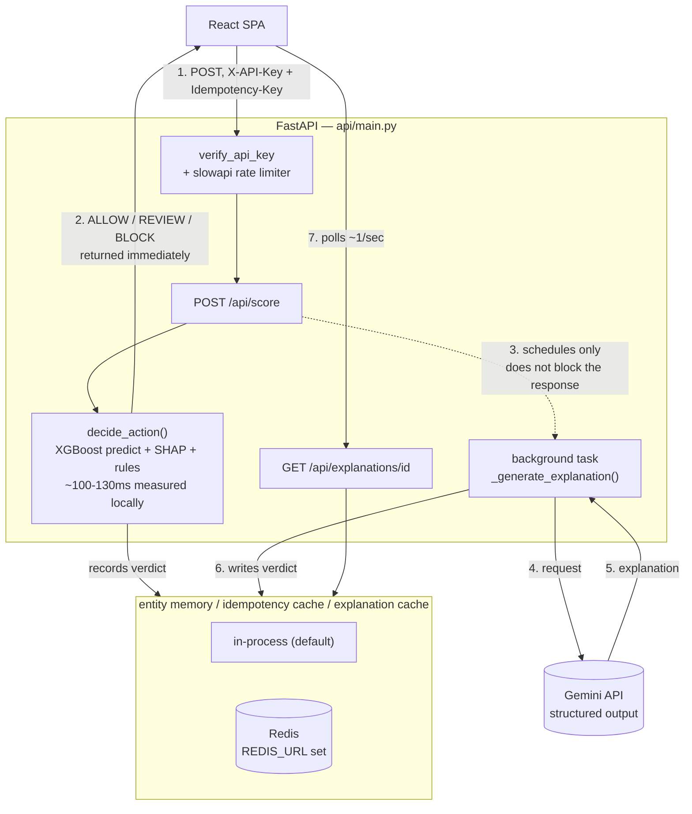

# AI Risk Manager — Razorpay Buildathon (Track 2)

An entity-aware transaction risk system: an XGBoost model scores each
transaction, SHAP explains which signals drove the score, and a
**Gemini-powered LLM agent** (via the Google Gen AI API, free tier)
reasons over both the transaction and the entity's (card/account)
recent risk trajectory to produce a human-readable explanation — with
the threshold itself chosen to minimize business cost, not just
maximize accuracy.

## Scope and honest limitations

Read this before the feature list below, not after. This project
targets the *same class* of problem Razorpay's own engineering posts
describe — entity-level judgment consistency, escalation under
uncertainty, cost-based decision thresholds (see [Does this system
agree with itself?](#does-this-system-agree-with-itself-and-why-this-question-not-another)
for the specific posts and pain points) — but validates that on a
public card-transaction dataset (IEEE-CIS), not real Razorpay merchant
data, because real merchant-review data isn't available outside
Razorpay. That's a deliberate scoping choice, not a claim that this
system was tested against, or directly solves, Razorpay's actual
merchant-review problem as-is. Concretely:

- The live demo scores either a replay of a fixed ~30-entity historical
  sample or a user-constructed synthetic transaction (see the Live
  Scoring tab under [5. Launch the frontend](#5-launch-the-frontend))
  — never a live payment stream.
- "Entity" here is a synthesized card + address + email fingerprint
  (see [A note on the dataset and the entity
  fingerprint](#a-note-on-the-dataset-and-the-entity-fingerprint)
  below), not a merchant account.
- The LLM never makes the authorization decision — it only explains
  one already made deterministically (see point 4 below).

## Why this is different from a standard fraud classifier

Most fraud-detection submissions stop at: train a classifier, wrap it
in SHAP, done. This project makes several deliberate additions, each
solving a real gap in that standard approach:

1. **Entity risk memory** — the closest thing this system has to
   "agentic" behavior, though it never acts autonomously: every
   escalation decision is still a deterministic threshold comparison,
   fully auditable, never a model call. Transactions aren't scored in
   isolation. Each card/account fingerprint (`entity_id`) has a rolling
   verdict history; a severity-weighted "risk pressure" accumulated
   from that history (a BLOCK counts for more than a REVIEW, and a
   high-scoring verdict counts for more than a borderline one — see
   `src/entity_memory.py`) pushes the entity into a `WATCH` or
   `ELEVATED` state once it crosses a cutoff chosen by a real grid
   sweep against the cost tradeoff, not guessed (see [Does entity
   escalation actually help?](#does-entity-escalation-actually-help)).
   The LLM agent is given this state explicitly and can escalate its
   recommended action beyond what the raw score alone suggests — and
   must say so, rather than silently overriding the model.

2. **Cost-optimal threshold, not just AUC — and not just one point
   estimate.** A risk team doesn't optimize accuracy — they minimize
   expected cost, where missed fraud and wrongly-blocked legitimate
   customers have very different costs. `src/cost_analysis.py` sweeps
   thresholds and picks the one that minimizes `false_negatives *
   avg_fraud_loss + false_positives * avg_fp_cost`, and reports the
   estimated savings vs. a naive 0.5 threshold. The cost assumptions
   are explicit, adjustable constants, not hidden inside a single
   "accuracy" number — and `threshold_sensitivity()` goes a step
   further, sweeping a grid of *plausible* cost assumptions (0.5x-2x
   the defaults) so the "optimal" threshold is reported as a range,
   not a single number staked on guessing two constants exactly right.
   See [Does the cost-optimal threshold hold up under different cost
   assumptions?](#does-the-cost-optimal-threshold-hold-up-under-different-cost-assumptions)

   The live REVIEW/BLOCK decision boundaries `decide_action()` actually
   gates transactions with (see point 4 below) are themselves derived
   from this same cost analysis by `train_model.py`, not hardcoded:
   `review_threshold` is the cost-optimal threshold at the default cost
   assumptions (currently **34.0** on the 0-100 risk-score scale), and
   `block_threshold` is the cost-optimal threshold recomputed with
   `avg_fp_cost` scaled 6x (`BLOCK_FP_COST_MULTIPLIER`, currently
   **71.0**) — i.e. "only auto-block when the model would still flag it
   even if false positives were far more expensive than assumed."
   Both are saved to `models/decision_thresholds.joblib` and loaded by
   the live API, the offline ablation/consistency scripts, and the LLM
   system prompt alike (`src/decision_rules.py`), so none of them can
   silently drift apart after a retrain.

3. **Structured LLM output, not scraped JSON.** `src/llm_agent.py` calls
   Gemini (`gemini-3.6-flash`) through the Google Gen AI SDK's
   structured outputs (`response_schema=RiskVerdict`, a Pydantic model,
   read back via `response.parsed`), so the action is schema-constrained
   to `ALLOW`/`REVIEW`/`BLOCK` at generation time rather than hoping the
   model's free-text JSON parses. Untrusted transaction fields (email
   domain, product code, etc.) are sanitized before being interpolated
   into the prompt, and the system prompt explicitly instructs the
   model to treat them as data, never as instructions — a basic
   prompt-injection defense, since those fields ultimately trace back
   to attacker-controlled transaction data.

4. **The LLM is never on the authorization critical path.** `POST
   /api/score` makes the ALLOW/REVIEW/BLOCK decision synchronously from
   the score and a deterministic rule table (`decide_action` in
   `api/main.py`) and returns immediately — this is what actually gates
   the transaction. Measured locally on CPU, that decision path (XGBoost
   predict + SHAP + rules) takes ~100-130ms; the Gemini API call it
   *doesn't* wait on adds real network + generation latency on top of
   that (and free-tier requests can additionally queue behind a rate
   limit). The LLM runs afterward as a FastAPI background task purely to
   generate a human-readable explanation for the reviewer queue; the
   frontend polls `GET /api/explanations/{verdict_id}` for it. A
   real-time payment authorization path can't block on an LLM API call
   (latency, and a rate limit or outage on the vendor's side
   shouldn't take down transaction authorization), so this mirrors how
   such systems are actually built — decision first, explanation
   enrichment after.

5. **Idempotency on the scoring endpoint.** `POST /api/score` accepts an
   optional `Idempotency-Key` header (the same convention Razorpay's own
   API asks integrators to use). A retried request with the same key
   returns the original cached response instead of re-scoring — without
   this, a network retry or a double-submit would score the same
   transaction twice and double-count it in the entity's escalation
   history, incorrectly pushing them toward `WATCH`/`ELEVATED`.

6. **Optional Redis-backed state, same behavior either way.** Entity
   escalation history, the idempotency cache, and pending/ready
   explanations all live in-process by default (session-scoped, zero
   setup — the right default for local dev/demo). Set `REDIS_URL` and
   the exact same classes (`RedisEntityRiskMemory`, `KeyedCache` in
   `src/entity_memory.py` / `src/redis_utils.py`) back the same state
   with Redis instead — surviving restarts and shareable across
   workers — with no behavior change for the caller. `tests/` runs the
   *same* test suite against both backends (via a parametrized fixture,
   not separate test files) to prove they actually agree, not just that
   each one individually "works."

7. **Rate limiting on the expensive endpoint.** `POST /api/score` is
   capped at 30 requests/minute per caller (`X-API-Key` if present,
   else source IP) via `slowapi` — a fraud-scoring endpoint that calls
   an ML model and (asynchronously) an LLM shouldn't be able to be
   hammered with no limit. Cheap read routes (`/api/entities`, etc.)
   are deliberately not subject to this budget.

8. **A human review queue that closes the feedback loop.** A model's
   score isn't the end of a real fraud pipeline — a human disposing a
   prioritized queue, and that disposition feeding back into the system,
   is. Every REVIEW/BLOCK verdict lands in `src/review_queue.py`
   (same REDIS_URL-optional design as entity memory); a reviewer marks
   each one `CONFIRMED_FRAUD` or `FALSE_POSITIVE` in the frontend's
   Review Queue tab (`POST /api/review-queue/{verdict_id}/disposition`,
   `409` on a repeat disposition so a retry can't silently overwrite a
   reviewer's call). `GET /api/review-queue/metrics` then recomputes
   [Phase 0's escalation-ablation comparison](#does-entity-escalation-actually-help)
   from these *live* dispositions — precision specifically among
   escalation-triggered flags vs. non-escalated ones — instead of only
   the offline test set. Each item also carries a free-text note thread
   (`POST /api/review-queue/{verdict_id}/notes`) and a same-entity
   related-items lookup (`GET /api/review-queue/{verdict_id}/related`)
   so a reviewer can see prior context for that entity without leaving
   the queue; pending items show their age since `created_at` with
   escalating visual urgency in the frontend, so an old, forgotten item
   doesn't quietly sit unreviewed.

## A note on the dataset and the entity fingerprint

IEEE-CIS is a genuinely anonymized dataset — it deliberately does not
ship a raw account/merchant ID. `src/data_utils.py` builds a proxy
entity fingerprint from `card1 + card2 + card5 + addr1 +
P_emaildomain`. This is the well-known "UID" technique used in several
top-performing solutions to the original Kaggle competition, not
something invented for this project — it mirrors how real card
networks do entity resolution (device + card + address fingerprinting)
when no explicit account ID is available in the event stream. With
real Razorpay data, you'd use the actual merchant/account ID directly.

To be explicit about what that means for this project's grounding
(see [Scope and honest limitations](#scope-and-honest-limitations)
above): this "entity" is a card+address+email fingerprint on
individual card-not-present transactions, not a Razorpay merchant
account. The entity-level questions this project asks — does watching
an entity's recent history help, is the system consistent with
itself on repeat looks at the same case — are the same *class* of
question Razorpay's posts raise about merchant review, answered here
on a public proxy dataset because real merchant-review data isn't
available, not a claim that this validates against Razorpay's actual
merchant population or review workflow.

## Setup

```bash
pip install -r requirements.txt        # runtime only
pip install -r requirements-dev.txt    # + pytest, fakeredis, etc. — includes requirements.txt
```

Both files are pinned to exact versions (`pip freeze`-style, hand-trimmed
to what's actually imported) for reproducible installs.

### 1. Get the data

This is a **Kaggle competition** dataset — you must join the
competition once (free, one click) before the API will let you
download it:
https://www.kaggle.com/competitions/ieee-fraud-detection

Then, with Kaggle API credentials configured (`~/.kaggle/kaggle.json`
or `KAGGLE_USERNAME`/`KAGGLE_KEY` env vars):

```bash
python src/download_data.py
```

This places `train_transaction.csv` and `train_identity.csv` in `data/`.

### 2. Set your API keys

Copy the example env file and fill it in:

```bash
cp .env.example .env
```

- **`API_KEY`** — required for every `/api/*` route except `/api/health`.
  There's no default: if unset, the API rejects every request with 401
  (fail closed) rather than being left open. Generate one yourself:
  ```bash
  python -c "import secrets; print(secrets.token_urlsafe(32))"
  ```
- **`GEMINI_API_KEY`** — free key from
  [aistudio.google.com/apikey](https://aistudio.google.com/apikey), no
  billing required (rate-limited). Without this set, `/api/score` still
  returns the instant ALLOW/REVIEW/BLOCK decision (see point 4 above) —
  only the AI explanation panel falls back to a "credentials missing"
  message.

The backend doesn't auto-load `.env` on its own — either export the
values into your shell, or run uvicorn with `--env-file .env` (requires
`python-dotenv`, not currently a dependency):

```bash
export API_KEY=...          # macOS/Linux
export GEMINI_API_KEY=...
```
```powershell
$env:API_KEY = "..."        # Windows PowerShell, current session
$env:GEMINI_API_KEY = "..."
setx API_KEY "..."          # Windows PowerShell, permanent (needs a new terminal to take effect)
setx GEMINI_API_KEY "..."
```

### 3. Train the model

```bash
python src/train_model.py
```

Writes `models/risk_model.joblib`, `models/feature_cols.joblib`,
`models/optimal_threshold.joblib`, and `models/eval_report.txt`
(AUC/PR-AUC plus the cost-based threshold analysis — this is what
you'll quote in the pitch). It also writes two structured companions
to that text report: `models/cost_summary.json` (savings, ROC-AUC —
feeds the Overview tab's headline and "At a glance" panel) and
`models/cost_curve.json` (per-threshold error counts, so
`GET /api/cost-analysis` can serve the cost-vs-threshold curve for any
cost assumption without re-scoring the test set).

### 4. Launch the API backend

```bash
uvicorn api.main:app --reload --port 8000
```

This serves the scoring/explanation/cost-analysis logic as a JSON API
at `http://localhost:8000/api/...`.

**First run is slow, and that's expected:** importing pandas/xgboost/shap
takes ~20-30s before the server is even listening, and the very first
`/api/entities` request loads and feature-engineers the full ~590K-row
CSV (a couple of minutes) before caching the small sample it actually
serves to `models/sample_data_cache.pkl`. Every request after that —
including future restarts, as long as that cache file exists — is fast
(well under a second). Don't open the frontend until the backend
terminal prints `Application startup complete.`, or you'll see
connection errors that look like a bug but are really just "not ready
yet."

### 5. Launch the frontend

```bash
cd frontend
cp .env.example .env   # set VITE_API_KEY to the same value as the backend's API_KEY
npm install
npm run dev
```

Opens the app at `http://localhost:5173` (Vite dev server proxies
`/api/*` to the backend on port 8000 — see `frontend/vite.config.ts`).
Vite loads `.env` automatically — no export/shell step needed here,
unlike the backend. If `VITE_API_KEY` doesn't match the backend's
`API_KEY` exactly, every request the UI makes will 401.
For a production build: `npm run build` (outputs static assets to
`frontend/dist/`), served by any static host or reverse-proxied behind
the FastAPI backend.

**Overview tab:** leads with one headline number — a real, computed
extrapolation of the cost-optimal threshold's measured savings
(`src/impact_summary.py`) to an assumed monthly transaction volume,
with the assumption stated directly beneath it, never shown alone. From
the current real run: **Rs 421,850 saved on the 118,108-transaction
test set → Rs 17,85,865/month extrapolated at an assumed 500,000
transactions/month** (`ASSUMED_MONTHLY_TRANSACTION_VOLUME` — an
illustrative constant for scale, not a real Razorpay volume figure).
Regenerate it with `python src/train_model.py`, which now also saves
`models/cost_summary.json`; served via `GET /api/cost-analysis`'s
`headline_monthly_savings_estimate`/`headline_basis` fields.

**Live Scoring tab:** two modes, toggled at the top of the sidebar.

- *Replay historical* — pick one of the ~30 cached entities, walk
  through its transactions in sequence, and watch the escalation state
  build up as verdicts accumulate. This is the part to demo live, since
  it's the piece a static classifier genuinely can't do. Click **Play**
  to step through the entity's whole transaction sequence automatically
  (1x/2x/4x speed) instead of clicking "Score this transaction"
  repeatedly — useful for letting escalation build up on screen without
  narrating each click. The interval is capped so no speed setting can
  exceed the live `/api/score` rate limit (30/minute): the 1x/2x
  intervals (6s/3s) sit comfortably under it, and 4x is clamped up to a
  2.1s floor rather than actually running at the naive 1.5s that speed
  would otherwise imply. Manual stepping (the slider and the score
  button) keeps working exactly as before; Play just automates it.
- *Score custom* — construct a transaction from scratch (amount,
  product code, card network/type, email domains, device type, billing
  region/country, hour of day) that isn't in the historical sample at
  all, via `POST /api/score-custom`. Anything not filled in is left
  missing and handled exactly like any other missing feature (see
  `RiskExplainer.score_transaction`). Optionally attach it to an
  existing entity to score it against that entity's *current* real
  escalation state instead of a cold start — doing so also records the
  resulting verdict into that entity's real history, since attaching is
  an explicit opt-in; leaving it unattached never touches any entity's
  history, no matter how many times the same hypothetical is scored.

Both modes go through the exact same
`RiskExplainer.score_transaction` → `decide_action` →
`_generate_explanation` → review-queue pipeline and render in the same
results panel: the automated decision (action + escalation flag)
appears instantly; the "AI Reviewer Explanation" panel below it fills
in a moment later once the background LLM call finishes — that gap is
intentional, not a loading bug (see point 4 above).

**Model Validation tab:** every offline analysis this project ran to
check its own claims, consolidated into one accordion (Cost-Optimal
Threshold/Sensitivity/Drift, Entity Escalation Ablation, Cold-Start
Graph Features, Consistency) instead of five separate top-level tabs —
so Live Scoring and Review Queue, the two interactive tabs, are the
first two a judge sees. Nothing is deleted or hidden, just reorganized;
each section adjusts the fraud-loss/false-positive-cost assumptions
(Cost-Optimal Threshold) or shows the real report from its underlying
script (the other three), expanding on click.

### Docker (alternative to steps 4-5)

Runs the backend, frontend, and Redis together — requires `models/`
already populated (step 3) and `.env` set up (step 2):

```bash
docker compose up --build
```

Backend: `http://localhost:8000` · Frontend: `http://localhost:5173`
(nginx, reverse-proxying `/api/*` to the backend container — see
`frontend/nginx.conf`). Redis is wired in automatically
(`REDIS_URL=redis://redis:6379/0`), so entity escalation state and the
idempotency cache survive `docker compose restart backend`.

One gotcha specific to the frontend image: `VITE_API_KEY` has to be a
**build** arg, not a container `environment:` entry — Vite bakes
`import.meta.env.VITE_*` into the static JS bundle at `npm run build`
time, before the container ever runs (see `frontend/Dockerfile`'s
comment). `docker-compose.yml` already wires this correctly via
`build.args`; it's only a trap if you build the frontend image by hand.

### Running tests

```bash
pytest                                    # run everything
pytest --cov=src --cov=api --cov-report=term-missing   # with coverage
```

Runs clean with **no trained model, no Kaggle dataset, no `API_KEY`, no
`GEMINI_API_KEY`, and no real Redis** — every module's tests either
exercise pure logic directly or fake out the one thing that needs real
credentials/data/infra (`tests/conftest.py`'s `client` fixture fakes
`get_sample_data`, `get_explainer`, and `get_agent`; `test_llm_agent.py`
mocks the Gemini client; `test_entity_memory.py` and `test_keyed_cache.py`
use `fakeredis` for the Redis-backed paths).

- `test_entity_memory.py` — WATCH/ELEVATED threshold crossing, the
  rolling-window eviction, single-vs-all `reset()` — **parametrized to
  run the identical suite against both `EntityRiskMemory` (in-process)
  and `RedisEntityRiskMemory` (fakeredis)**, proving they actually agree
  rather than each just passing its own tests.
- `test_keyed_cache.py` — same parametrized-against-both-backends
  approach, for the cache class the idempotency store and explanation
  store are both built on.
- `test_rate_limit.py` — fires 31 requests at `/api/score` in a loop and
  asserts the 31st gets 429; confirms other routes aren't subject to
  the same budget.
- `test_cost_analysis.py` — a hand-computable fraud/legit example, so
  `cost_curve`'s fn/fp/tp counts and `optimal_threshold`'s savings math
  are checked against numbers worked out by hand, not just "doesn't crash."
- `test_data_utils.py` — the **leakage-prevention test that matters
  most**: asserts `add_causal_entity_history` computes each row's prior
  fraud rate using only strictly-earlier transactions for that entity —
  written so it would fail if the causal shift were ever accidentally
  removed (verified by hand against a broken variant while writing it).
- `test_risk_explainer.py` — trains a tiny real XGBoost model as a
  fixture (not the 590K-row CSVs) and includes a regression test for the
  single-row categorical-dtype bug described in the module's own docstring.
- `test_api.py` / `test_api_auth.py` — every route via FastAPI's
  `TestClient`: happy paths, 400/404s, the `Idempotency-Key` dedup
  behavior (same key → identical response, verdict recorded once, not
  twice), the auth dependency (401 without/with-wrong key, fail-closed
  when `API_KEY` itself is unset), and a regression test proving a crash
  inside the background explanation task resolves to a safe fallback
  instead of leaving the frontend polling "pending" forever.
- `test_llm_agent.py` — prompt-injection sanitization and every Gemini
  failure path (missing/invalid key, rate limiting, server errors,
  malformed schema) against a mocked client.
- `test_logging_utils.py` — the JSON log formatter's output shape, the
  request-id filter/middleware (including that it survives into the
  `/api/score` background task, not just the request handler), and that
  `/metrics` is reachable and looks like Prometheus text format.

**Frontend** (component smoke tests, Vitest + React Testing Library):

```bash
cd frontend
npm run test
```

`LiveScoring.test.tsx` and `CostAnalysis.test.tsx` mock `api/client.ts`
entirely — no backend needed. Cover: the entity dropdown/numeric inputs
render from mocked API responses, inputs trigger a re-fetch, and API
errors surface as visible error text.

## Project structure

```
risk-manager/
├── data/                        <- train_transaction.csv, train_identity.csv
├── models/                      <- generated by train_model.py
├── src/
│   ├── download_data.py         <- pulls IEEE-CIS via kagglehub
│   ├── data_utils.py            <- merge, entity fingerprint, causal features, time split
│   ├── cost_analysis.py         <- threshold -> business cost curve
│   ├── train_model.py           <- trains XGBoost, picks cost-optimal threshold
│   ├── risk_explainer.py        <- SHAP wrapper: score -> top factors
│   ├── entity_memory.py         <- rolling verdict history -> escalation state (in-process + Redis)
│   ├── redis_utils.py           <- optional-Redis client factory + KeyedCache (idempotency/explanations)
│   ├── decision_rules.py        <- decide_action() — shared by the live API and offline analyses
│   ├── escalation_ablation.py   <- offline: does entity escalation actually help? (see below)
│   ├── cost_sensitivity.py      <- offline: cost-optimal threshold sensitivity sweep (see below)
│   ├── drift_analysis.py        <- offline: temporal drift across the test window (see below)
│   ├── graph_features.py        <- causal device/address graph features for cold-start entities
│   ├── graph_features_ablation.py <- offline: cold-start recall before/after graph features (see below)
│   ├── review_queue.py          <- human review queue + feedback-loop metrics (in-process + Redis)
│   ├── consistency_analysis.py  <- offline: does this system agree with itself? (see below)
│   └── llm_agent.py             <- Gemini (Google Gen AI API) agent, reasons over score + history
├── api/
│   ├── main.py                  <- FastAPI JSON API wrapping the src/ modules
│   └── logging_utils.py         <- JSON log formatter + request-id middleware
├── tests/
│   ├── conftest.py               <- shared fixtures: fake data/model/agent, FastAPI TestClient
│   ├── test_entity_memory.py     <- parametrized: in-process AND Redis (fakeredis)
│   ├── test_keyed_cache.py       <- parametrized: in-process AND Redis (fakeredis)
│   ├── test_cost_analysis.py     <- includes threshold_sensitivity() grid arithmetic
│   ├── test_data_utils.py        <- includes leakage-prevention tests for entity + graph features
│   ├── test_risk_explainer.py
│   ├── test_api.py               <- routes, idempotency, decide_action
│   ├── test_api_auth.py          <- API_KEY auth, fail-closed behavior
│   ├── test_rate_limit.py        <- 30/minute on /api/score
│   ├── test_logging_utils.py     <- JSON formatter, request-id propagation, /metrics
│   ├── test_escalation_ablation.py <- metric arithmetic (recall/false-flag-rate/precision)
│   ├── test_drift_analysis.py    <- bucketing logic + metric arithmetic on synthetic series
│   ├── test_review_queue.py      <- parametrized: in-process AND Redis (fakeredis)
│   ├── test_consistency_analysis.py <- pure computation functions, MagicMock Gemini client
│   └── test_llm_agent.py         <- mocked Gemini client
├── requirements.txt              <- pinned, runtime only
├── requirements-dev.txt          <- + pytest/fakeredis/etc, includes requirements.txt
├── Dockerfile                    <- backend image
├── docker-compose.yml            <- backend + frontend + redis
├── .dockerignore
├── .github/workflows/ci.yml      <- pytest --cov (backend) + lint/build (frontend), on every push/PR
└── frontend/                    <- React + TypeScript + Tailwind SPA
    ├── Dockerfile                <- multi-stage: node build -> nginx
    ├── nginx.conf                <- serves the SPA, proxies /api/* to the backend container
    ├── vitest.config.ts
    └── src/
        ├── api/client.ts        <- typed fetch client for the backend
        ├── components/
        │   ├── Overview.tsx
        │   ├── LiveScoring.tsx (+ .test.tsx)
        │   ├── ReviewQueue.tsx (+ .test.tsx)
        │   ├── ModelValidation.tsx (+ .test.tsx)  <- accordion nesting the four below
        │   ├── CostAnalysis.tsx (+ .test.tsx)     <- cost threshold, sensitivity, drift
        │   ├── EscalationAblation.tsx (+ .test.tsx)
        │   ├── ColdStartAnalysis.tsx (+ .test.tsx)
        │   └── ConsistencyAnalysis.tsx (+ .test.tsx)
        ├── test/setup.ts
        └── App.tsx
```

## Latency budget: the LLM can never degrade the decision

The decision path does not call the LLM — that has always been the
design. What was missing was a defense against the LLM being *slow*
rather than broken: a call that hangs occupies a worker thread for its
full duration, and enough of those starve the pool until scoring, which
needs no LLM at all, starts queueing behind explanations.

Two mechanisms close that:

- **A hard wall-clock timeout** (`LLM_TIMEOUT_SECONDS`, default 20) on
  both the batch and streaming calls, including opening the stream. A
  timeout returns its own fallback message, distinct from the
  bad-key/rate-limit/unreachable ones — the operational response to each
  differs, so they are not collapsed into one string.
- **A circuit breaker** (`src/circuit_breaker.py`, ~40 lines, no
  dependency). After `LLM_BREAKER_THRESHOLD` consecutive failures
  (default 5) it opens for `LLM_BREAKER_COOLDOWN_SECONDS` (default 60),
  returning the fallback immediately instead of spending the timeout
  rediscovering that the API is down. The failure counter lives in Redis
  when configured, so one worker learning the API is down spares the
  others.

`GET /api/health` reports breaker state, consecutive failures and time
until retry. `status` stays `ok` with the breaker open: explanations are
best-effort, and their failure is deliberately not a failure of this
service.

**The breaker gates exactly one dependency.** Scoring, entity memory and
the review queue are untouched by it.

Measured with a deliberately invalid `GEMINI_API_KEY`, scoring the same
transaction six times:

| Score | Decision | Explanation outcome | Latency |
|---|---|---|---|
| 1-5 | REVIEW | agent unauthenticated (real call attempted) | 95-1410ms |
| 6 | REVIEW | circuit breaker open (no network call) | **9ms** |

All six returned the correct risk score and decision; `/api/health`
showed `open`, 5 consecutive failures, 60s until retry.

## How the explanation reaches the browser

The decision is synchronous and the explanation is not — that has always
been true here. What changed is how the frontend finds out.

`GET /api/verdicts/{verdict_id}/stream` is a Server-Sent Events endpoint.
It emits `decision` immediately, then `explanation_delta` events carrying
text as Gemini produces it (`llm_agent.explain_stream`, the SDK's
streaming call), then a terminal `explanation_complete` with the same
validated verdict object `GET /api/explanations/{verdict_id}` returns —
or `error` carrying the same fallback the batch path would have produced.

SSE rather than WebSockets: this is strictly one-directional
server→client, and SSE reconnects natively, survives proxies better, and
needs no new dependency. `GET /api/explanations/{verdict_id}` remains as
the polling fallback — the frontend retries the stream once, then falls
back to it, so a proxy that buffers event streams degrades instead of
hanging.

**This replaced the Phase 8 typing animation.** That phase simulated a
typewriter over already-complete text, which was the honest option while
the transport was polling. The text now genuinely arrives in chunks from
the model, so the simulation was deleted rather than layered on top of
the real thing.

With multiple workers, the process running the LLM call is usually not
the one holding the client's connection, so deltas travel over Redis
pub/sub (`src/explanation_bus.py`). Without Redis they stay in-process,
which is correct for the single-worker development mode — unlike
ingestion below, where falling back would have been a lie.

Verified in a browser: one open SSE connection, zero polling requests,
and the explanation growing 10 → 43 → 82 → 118 characters as chunks
arrive.

## Streaming ingestion

Everything above enters the system through a synchronous API call from
the UI. `POST /api/events/transaction` is the other way in: a
webhook-shaped endpoint meant for a payment processor rather than a
person.

It validates the payload, deduplicates on the sender's `event_id`,
publishes the event to a **Redis Stream**, and returns `202 Accepted`
with a `verdict_id` — without scoring. That ordering is the point: a
webhook sender times out, it does not wait for a model, let alone an
LLM. Scoring happens in a separate worker process:

```bash
# alongside the API (needs REDIS_URL set)
python -m src.stream_consumer

# or as part of the stack, scaled to taste
docker compose up --scale consumer=3
```

The consumer reads from a Redis Streams **consumer group**, so several
workers share one stream without duplicating work, and every message is
acknowledged only after it is scored. A message that fails is left
pending and redelivered; after `MAX_DELIVERY_ATTEMPTS` it moves to a
dead-letter stream, readable at `GET /api/events/dead-letter` so a
failed event doesn't require a Redis CLI to find. A message read by a
worker that then crashed is reclaimed by another worker
(`XAUTOCLAIM`) rather than sitting pending forever.

Both the consumer and the synchronous endpoints score through one
function — `ScoringService.score_and_decide` in `src/scoring_service.py`.
That extraction is deliberate: two entry points into scoring is exactly
how a system grows two different answers to "would this be blocked", so
`tests/test_stream_consumer.py` asserts the two paths agree on the same
input rather than assuming they do.

**This endpoint requires Redis and returns 503 without it.** Everywhere
else in this project Redis is optional and absence falls back to
in-process state; durable ingestion is the one place where that would be
a lie, because an in-process queue would accept events and lose them on
restart while looking exactly like a working pipeline. The synchronous
`/api/score` and `/api/score-custom` paths are unaffected and still need
no Redis.

Rate limits differ by intent: `/api/score` allows 30/minute because a
human drives it; ingestion allows 600/minute (`INGEST_RATE_LIMIT`)
because a machine does.

## Architecture



Two paths, and the whole point of the design is that they don't block
each other:

- **Synchronous (steps 1-2):** the ALLOW/REVIEW/BLOCK decision that
  actually gates the transaction — score, SHAP, `decide_action()` — all
  inside the request/response cycle, in ~100-130ms. This is what a
  real-time authorization path can rely on.
- **Asynchronous (steps 3-7):** the human-readable explanation. Scheduled
  as a background task *after* the response has already gone out; the
  frontend polls for it separately. A slow or down Gemini API delays the
  explanation panel, never the decision.

`STATE` — entity escalation history, the idempotency cache, and the
explanation cache — is in-process by default and optionally Redis-backed
(`REDIS_URL`); see point 6 in the section above and `src/entity_memory.py`
/ `src/redis_utils.py`.

## Authentication

Every `/api/*` route except `/api/health` (and `/metrics`, see
[Observability](#observability) below) requires an `X-API-Key` header
matching the server's `API_KEY` environment variable.

```bash
curl http://localhost:8000/api/entities \
  -H "X-API-Key: your-api-key-here"
```

- **No key configured on the server → every protected request gets
  401**, regardless of what header is sent. There's no fallback or
  auto-generated default — see `verify_api_key` in `api/main.py`.
- **Missing or wrong key → 401** with a JSON `{"detail": "..."}` body
  explaining which of the two happened.
- Generate a key yourself; it's an opaque shared secret, not a signed
  token:
  ```bash
  python -c "import secrets; print(secrets.token_urlsafe(32))"
  ```
- The frontend sends this automatically once `frontend/.env`'s
  `VITE_API_KEY` matches the backend's `API_KEY` — see Setup step 5.

## Rate limiting

`POST /api/score` — the endpoint that runs the ML model — is limited to
**30 requests/minute per caller**, identified by `X-API-Key` when
present (so all traffic under one key shares one budget) or by source IP
otherwise. Every other route (`/api/entities`, `/api/cost-analysis`,
etc.) is unaffected.

Exceeding the limit returns `429 Too Many Requests` with:

```json
{"error": "Rate limit exceeded: 30 per 1 minute"}
```

Backed by the same optional Redis as entity memory (`storage_uri` on the
`slowapi.Limiter` in `api/main.py`) — in-process by default, so the
budget is per-process unless `REDIS_URL` is set, in which case it's
shared across restarts/workers too.

## Observability

- **Structured logs:** every log line the app emits is JSON (see
  `api/logging_utils.py`) — `timestamp`, `level`, `logger`, `message`,
  plus a `request_id` that's the same for a request's route handler and
  its `/api/score` background task (propagated via `contextvars`, not
  threaded through function signatures), so you can grep one request's
  full story out of the log stream. The same id comes back as an
  `X-Request-ID` response header for client-side correlation. This only
  reconfigures the *root* logger — uvicorn's own access/error logs are
  untouched.
- **Metrics:** `GET /metrics` (Prometheus text format, via
  `prometheus-fastapi-instrumentator`) — request count and latency per
  route. Deliberately not behind `verify_api_key`: Prometheus scraping
  conventions assume network-level access control, not an application
  key, and it's operational data, not customer data.

## Does the cost-optimal threshold hold up under different cost assumptions?

`models/eval_report.txt` quotes one cost-optimal threshold (0.34) computed
from a single assumed cost pair (avg_fraud_loss = Rs 5,000, avg_fp_cost =
Rs 150) — a real risk team's first question would be "how much does that
threshold move if those two numbers are wrong?" `src/cost_sensitivity.py`
answers that directly: it scores the same real chronological test set
(118,108 transactions) with the already-trained model, then sweeps both
costs from 0.5x to 2x their defaults via `cost_analysis.threshold_sensitivity()`.
Run it yourself with `python src/cost_sensitivity.py`; output is saved to
`models/cost_sensitivity_report.json` (consumed by `GET
/api/cost-analysis/sensitivity` and the sensitivity table in the frontend's
Cost Analysis tab) and `models/cost_sensitivity_report.txt`. The table
below is the actual grid from that run (against the current model, which
includes the device/address graph features from Phase 3) — not invented:

| avg_fraud_loss ↓ / avg_fp_cost → | Rs 75 | Rs 150 | Rs 225 | Rs 300 |
|---|---|---|---|---|
| **Rs 2,500** | 0.34 | 0.55 | 0.58 | 0.68 |
| **Rs 5,000** | 0.23 | 0.34 | 0.38 | 0.55 |
| **Rs 7,500** | 0.18 | 0.28 | 0.34 | 0.38 |
| **Rs 10,000** | 0.13 | 0.23 | 0.28 | 0.34 |

Across this 4x4 grid, the cost-optimal threshold ranges from **0.13 to
0.68** — over a 5x spread — depending entirely on where the two assumed
costs actually fall within a plausible 0.5x-2x range. The single 0.34
figure quoted elsewhere in this README is the midpoint of that grid (the
default Rs 5,000 / Rs 150 cell), not a precise, defensible number on its
own. **Honest read:** the direction of the sensitivity is intuitive
(costlier missed fraud pulls the threshold down toward flagging more;
costlier false positives pushes it up toward flagging less), but the
magnitude of the swing means this project's specific "0.34" shouldn't be
quoted as if it were exact — what should be quoted is that a real
deployment needs real cost figures from finance/ops before the threshold
number means anything precise.

## Does entity escalation actually help?

The entity-escalation feature (`src/entity_memory.py`) is the project's
headline "agentic" claim: an entity with recent REVIEW/BLOCK verdicts
gets watched more closely on its next transaction. That claim is
measured, not just asserted — `src/escalation_ablation.py` replays the
real chronological test set (118,108 transactions, the same split
`train_model.py` uses) in time order through a fresh `EntityRiskMemory`,
scoring every transaction two ways: **baseline** (raw model score only,
escalation forced to `NORMAL`) vs. **escalation-adjusted** (exactly what
the live system does today). Run it yourself with
`python src/escalation_ablation.py`; the full output is saved to
`models/escalation_ablation_report.txt`, alongside
`models/escalation_ablation_summary.json` — the identical numbers in
structured form, which is what the Model Validation tab charts.

The escalation state itself is a **severity-weighted "risk pressure"**,
not a raw count of risky verdicts: a BLOCK contributes more than a
REVIEW, and a high-scoring verdict contributes more than a borderline
one (`VERDICT_WEIGHT`/`_risk_pressure()` in `entity_memory.py`). The
WATCH/ELEVATED cutoffs against that pressure value were chosen by a real
grid sweep (`sweep_pressure_thresholds()`), not guessed — 9 candidate
(watch, elevated) pairs, each replayed against the full real test set,
scored by the same cost formula (`false_negatives * avg_fraud_loss +
false_positives * avg_fp_cost`) `train_model.py`'s own threshold
derivation uses:

| watch | elevated | recall | false-flag | cost (Rs) |
|---|---|---|---|---|
| 0.8 / 1.2 / 1.6 | 2.0 | 0.9031 | 0.1794 | 5,039,450 |
| 0.8 / 1.2 / 1.6 | 2.8 | 0.8971 | 0.1594 | 4,817,150 |
| **0.8 / 1.2 / 1.6** | **3.6** | **0.8937** | **0.1471** | **4,676,400 (chosen — lowest cost)** |

**A real finding from that grid, worth stating plainly:** every WATCH
candidate produced *identical* numbers for a given ELEVATED candidate.
That's not a sweep bug — `decide_action()` only branches on
`escalation.state == "ELEVATED"`; WATCH never changes the deterministic
action, only the state label surfaced to the reviewer/LLM as an earlier
informational heads-up. So the sweep could only actually optimize the
ELEVATED cutoff (chosen: **3.6**); WATCH was picked for free at **0.8**
(the most sensitive candidate, giving the earliest heads-up) since it
has zero cost impact either way.

The numbers below are from the actual run against the chosen cutoffs
(against the current trained model, which includes the device/address
graph features from Phase 3) — not invented:

| | Baseline (no escalation) | Escalation-adjusted (live system) |
|---|---|---|
| Recall (frauds flagged) | 0.8834 (3,590 / 4,064) | 0.8937 (3,632 / 4,064) |
| False-flag rate (legit txns flagged) | 0.1167 (13,312 / 114,044) | 0.1471 (16,776 / 114,044) |

Escalation catches **42 more fraudulent transactions** than the raw
score alone (+1.03 points of recall) — and does so by flagging
**3,464 more legitimate transactions** (+3.04 points of false-flag
rate). Isolating just the transactions where escalation history is what
pushed the action higher than the raw score alone would have
(`escalated_due_to_history == True`): there were **5,933** such flips,
and only **193** of them (3.25%) were actually fraud.

**Honest read:** the severity-weighted formula, cost-tuned via a real
grid sweep, is a real improvement over the original count-based
version — same direction of effect (net recall win, more false
positives), but a much blunter tradeoff cut down to size: the count-based
version bought +2.63 points of recall for +8.37 points of false-flag
rate (13,473 flips, 2.49% actually fraud); the severity-weighted,
cost-chosen version buys +1.03 points of recall for +3.04 points of
false-flag rate (5,933 flips, 3.25% actually fraud) — roughly a third
of the false-positive volume for roughly a third of the recall gain,
at a *better* flip precision. It's still a blunt instrument in absolute
terms (under 3.3% of what it flags is actually fraud), and it's still
defensible as a second-look signal feeding a human review queue
(exactly how `decide_action()` uses it — pushing REVIEW to BLOCK, or
ALLOW to REVIEW, never silently auto-blocking on escalation alone), not
a precise fraud-ring detector. Note also that even at its cost-optimal
cutoff, escalation still costs more (Rs 4,676,400) than the pure
no-escalation baseline (~Rs 4,366,800 by the same formula) — the real
tradeoff this project can measure is "how much less blunt can
escalation be made," not "escalation beats no escalation on this cost
metric," and this README says so rather than the more flattering
half of that finding.

## Is the model still good later in the test window?

`models/eval_report.txt` quotes one ROC-AUC (0.9540) from one train/test
split and stops there — which quietly assumes a static model stays good
forever, even though fraud is adversarial and non-stationary.
`src/drift_analysis.py` checks that assumption directly: it takes the
real chronological test set, checks its actual `TransactionDT` span
first (**41.9 days**, not assumed), buckets it into equal-width windows
sized from that real span rather than a hardcoded "weekly" unit (41.9
days over the 4-6-bucket target lands on 6 buckets of ~7 days each —
computed, not guessed), and scores the *already-trained* model
separately in each bucket — no retraining per bucket, since the point is
to see how a static model's performance moves over time it hasn't seen.
Run it yourself with `python src/drift_analysis.py`; output is saved to
`models/drift_report.json` (consumed by `GET /api/drift-analysis` and
the chart below) and `models/drift_report.txt`. The numbers below are
from that actual run (against the current model, which includes the
device/address graph features from Phase 3) — not invented:

| Bucket (days into test window) | n | n_fraud | ROC-AUC | Precision | Recall |
|---|---|---|---|---|---|
| 0.0–7.0 | 18,525 | 636 | 0.9496 | 0.2197 | 0.8664 |
| 7.0–14.0 | 21,360 | 662 | 0.9574 | 0.2080 | 0.8927 |
| 14.0–20.9 | 19,697 | 562 | 0.9520 | 0.1817 | 0.8754 |
| 20.9–27.9 | 21,020 | 736 | 0.9506 | 0.1989 | 0.8859 |
| 27.9–34.9 | 19,824 | 724 | 0.9569 | 0.2253 | 0.8854 |
| 34.9–41.9 | 17,682 | 744 | 0.9557 | 0.2461 | 0.8898 |

**Honest read: no significant decay observed over this ~6-week window.**
ROC-AUC stays in a tight band (0.9496–0.9574, a spread of only 0.0078)
and recall stays in 0.87–0.89 throughout — there's no visible downward
trend across the window, just noise-level bucket-to-bucket variation
(precision swings a bit more, 0.18–0.25, consistent with precision
being more sensitive to the exact count of false positives in a smaller
bucket). This is consistent with the test period being short (six
weeks) and drawn from a single historical dataset rather than a live,
evolving fraud population — a real production deployment would still
need continuous monitoring, since fraud patterns are well known to
shift over longer horizons than this dataset can demonstrate one way or
the other. What this result actually supports is narrower and still
useful: **there's no evidence the model was already stale by the end of
the six-week test window it was evaluated on**, which is a real (if
modest) check most single-split eval reports never run at all.

## Does the device/address graph signal help on brand-new entities?

The hardest, highest-volume real fraud case is a **brand-new** card/
account with no history — and `entity_prior_txn_count`/
`entity_prior_fraud_rate` are blind to it by construction: a first-ever
transaction from any entity has `entity_prior_txn_count == 0`, fraud or
not, so those features carry zero signal for exactly the rows that need
it most. `src/graph_features.py` adds a causal (leakage-free, same
strictly-earlier-transactions discipline as `add_causal_entity_history`)
signal that doesn't require *this* entity to have any history of its
own: `shared_device_prior_entity_count` (how many distinct entities have
used this same device/address before) and `shared_device_prior_fraud_rate`
(the fraud rate among *all* prior transactions sharing that device/
address, across every entity).

**Coverage check first, as planned:** `DeviceInfo` is populated for only
**20.1%** of all transactions in this dataset (most rows have no
identity-table match at all) — genuinely sparse, as flagged going in.
`addr1`/`addr2` are far more complete (**88.9%**), so
`build_device_fingerprint()` falls back to an addr1+addr2 fingerprint
when `DeviceInfo` is missing, rather than leaving 80% of rows with no
signal. A transaction with neither available gets 0 for both features —
not lumped into a fake "unknown device" bucket, which would falsely
link unrelated entities.

`src/graph_features_ablation.py` captures the previously-saved model's
cold-start-subset performance as "before", retrains with the graph
features wired into `engineer_features()`/`get_feature_columns()`, and
reports "after" on the exact same test rows (real run — output in
`models/cold_start_report.txt`):

| | Before | After |
|---|---|---|
| Overall ROC-AUC | 0.9535 | 0.9540 |
| Cold-start recall (10,292 rows, 291 fraud) | 0.8282 | 0.8385 |
| Cold-start precision | 0.1388 | 0.1400 |

**Honest read: it helped, but only modestly — +1.03 points of recall
specifically on the cold-start subset** (0.8282 → 0.8385), with overall
AUC barely moving at all (+0.0005), which is exactly the pattern you'd
want to see if the feature is doing something real but narrow rather
than just adding noise the model happens to fit. The size of the effect
is consistent with the coverage numbers above: with real `DeviceInfo`
available for only 1 in 5 transactions, most cold-start rows still fall
back to the coarser addr1+addr2 fingerprint, which links fewer
distinct entities together than a true device ID would — a sparser
signal produces a smaller, not absent, effect. This is a real, if
modest, contribution rather than a feature shipped on faith: it moved
the number it was specifically built to move, on the subset it was
specifically built for, by a small but positive amount — and the honest
caveat is that a richer device signal (or a live deployment with better
device-fingerprinting coverage than this anonymized public dataset
provides) would likely move it further.

## Does this system agree with itself? (and why this question, not another)

Razorpay's own engineering blog names a specific, concrete pain point in
their merchant risk review process: reviewing ~12,000 cases a month,
~20 minutes each, and different analysts reaching different conclusions
when looking at the identical case
([Meet Bumblebee](https://engineering.razorpay.com/meet-bumblebee-the-multi-agent-ai-architecture-that-changed-fraud-detection-at-razorpay-c2b6d5704f51)).
A related post describes the same system from the merchant's side —
vague, inconsistent communication during review, reviewers losing
context on handoff
([Breaking the Risk Review Black Box](https://engineering.razorpay.com/our-obsession-with-merchant-experience-breaking-the-risk-review-black-box-7fa38d699ef1)).

This project has no panel of human reviewers to test that with. It does
have an LLM agent (`src/llm_agent.py`) that plays an equivalent role —
it looks at a case and recommends an action, the way a human reviewer
would — and unlike a human, it can cheaply be asked to look at the exact
same case multiple times. `src/consistency_analysis.py` measures that
directly, in two parts:

**Part A — boundary fragility** (free, full test set, no API calls): of
the 16,871 transactions the deterministic rules flag REVIEW/BLOCK,
**1,778 (10.54%)** sit within ±2 points of a decision boundary (the
real, cost-derived review/block thresholds computed by
`train_model.py` and loaded from `models/decision_thresholds.joblib` —
currently 34.0 and 71.0, see `src/decision_rules.py`) — close calls
where a couple of points of model noise could have gone the other way.
This is the automated analog of "this case was genuinely ambiguous,"
measured cheaply across the entire test set.

**Part B — LLM self-consistency and cross-agreement** (real Gemini API
calls): a deliberate 12-transaction × 2-escalation-context sample (24
pairs), calling `RiskExplainerAgent.explain()` 5 times per pair. Run it
yourself with `python src/consistency_analysis.py` (needs a real
`GEMINI_API_KEY`; it is a manual, occasional script, same as
`train_model.py` — it does not run in CI). Output is saved to
`models/consistency_report.json` (consumed by `GET
/api/consistency-analysis` and the Consistency section of the Model
Validation tab in the frontend) and
`models/consistency_report.txt`.

**Real result, and a real surprise along the way:** running this for
real surfaced something worth reporting on its own — Gemini's free tier
for `gemini-3.6-flash` turned out to enforce a **20-requests-PER-DAY**
quota (`GenerateRequestsPerDayPerProjectPerModel-FreeTier`), not the
per-minute rate limit a free tier more commonly implies. An earlier run
that same day (before Phase A's threshold rederivation) got through the
first 20 calls before hitting the daily cap; by the time this project's
decision thresholds moved from the hardcoded 40/80 to the real,
cost-derived 34.0/71.0 and this script was re-run to regenerate the
report against the new boundaries and band names, that day's 20-call
quota was already spent — so this run's 24 pairs (120 attempted calls)
all hit `429 RESOURCE_EXHAUSTED` immediately. The fallback-detection
logic did exactly its job here: all 24 pairs are correctly reported as
`insufficient_data` (0 valid responses each, excluded from every
aggregate), not silently counted as disagreement — which is the entire
point of `is_fallback_response()` and the `MIN_VALID_RESPONSES` guard.
See `models/consistency_report.txt` for the full, real per-pair output.

**Honest read, on two levels.** On the question this phase actually set
out to answer (does self-consistency hold up near the real decision
boundaries and under `ELEVATED` escalation?): this specific run has
**no real data to answer that with** — every one of the 24 pairs was
quota-exhausted before a single valid response came back. That's a real
null result, not a positive or negative finding, and it should be read
as exactly that rather than papered over. (A prior run the same day,
before the threshold rederivation, did get 4 pairs of real data — all
in the `clear_allow` band — showing perfect 100% self-consistency and
cross-agreement, including correctly escalating a low raw score from
ALLOW to REVIEW under `ELEVATED` history; that data point still stands
on its own merits, but it predates and doesn't use the current 34.0/71.0
thresholds, so it isn't reproduced here as if it were.) On the question
of whether this whole approach is practically deployable on a free
tier: **no, not at this design's scale** — a 20-calls/day cap means the
full 24-pair × 5-call design (120 calls) takes at minimum six separate
days to complete on the free tier alone, and re-running the script more
than once in a day (as happened here, to pick up a code change) can
burn the entire day's quota before the analysis itself gets a single
real data point. That is itself a legitimate, useful finding for anyone
considering this architecture for a real consistency-monitoring
pipeline, not a footnote to apologize for.

## Methodology notes (for the writeup / judges)

- **No leakage:** entity history features (`entity_prior_fraud_rate`,
  etc.) are computed using only transactions strictly earlier in time
  than the current one — a naive full-dataset aggregate would leak the
  label. Train/test is a **chronological** split (train on the earlier
  80% of transactions, test on the later 20%), not random, for the
  same reason.
- **Categorical handling:** XGBoost's native `enable_categorical=True`
  is used for fields like `ProductCD`, `card4`, `card6`,
  `P_emaildomain` rather than manual one-hot encoding — simpler and
  handles missingness natively, which this dataset has a lot of.
- **What I'd build next** given more time: extend the entity fingerprint
  with device/IP graph features for fraud-ring detection, and replace
  the fixed cost constants with ones pulled from real ops data.
  (Persisting entity memory in Redis so it survives restarts and scales
  across workers — previously listed here — is done; see point 6 above
  and `src/entity_memory.py`.)
