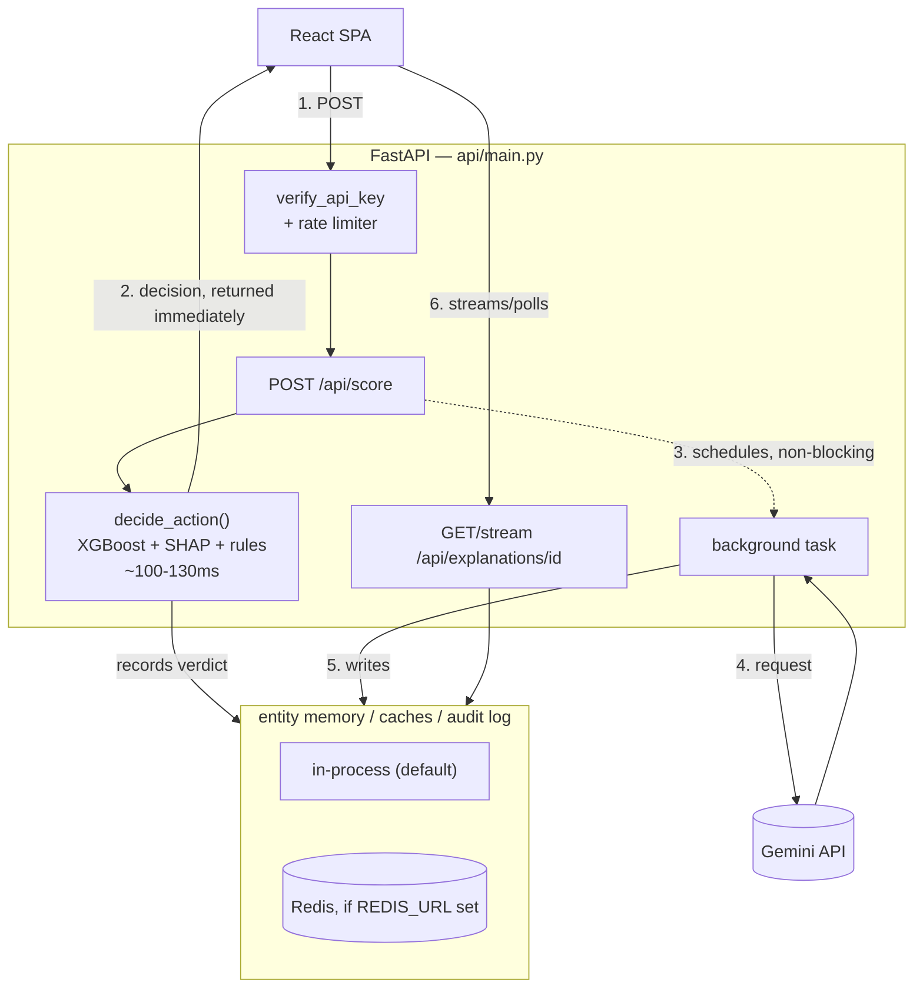

# AI Risk Manager — Razorpay Buildathon (Track 2)

An entity-aware transaction risk system: an XGBoost model scores each
transaction, SHAP explains the top factors, and a Gemini-powered LLM
agent reasons over the transaction plus the entity's (card/account)
recent risk history to produce a human-readable explanation. The
ALLOW/REVIEW/BLOCK decision itself is deterministic and cost-optimized
— the LLM never makes it, only explains it after the fact.

Validated on the public **IEEE-CIS** fraud dataset (Kaggle), not real
Razorpay merchant data — real merchant-review data isn't available
outside Razorpay. "Entity" here is a synthesized card + address +
email fingerprint (`src/data_utils.py`), not a merchant account. The
live demo replays a fixed historical sample or scores a
user-constructed synthetic transaction — never a live payment stream.

## Key design points

- **Entity risk memory** — a rolling, severity-weighted verdict
  history per entity pushes it into `WATCH`/`ELEVATED`, cutoffs chosen
  by a cost-based grid sweep (`src/entity_memory.py`).
- **Cost-optimal thresholds, not just AUC** — `src/cost_analysis.py`
  picks the threshold that minimizes `false_negatives * avg_fraud_loss
  + false_positives * avg_fp_cost`, with a sensitivity sweep over
  plausible cost assumptions. Both live thresholds are derived this
  way and saved to `models/decision_thresholds.joblib`.
- **LLM never on the decision path** — `POST /api/score` decides
  synchronously (~100-130ms) via `decide_action()`; the Gemini call
  runs after, as a background task, streamed to the frontend over SSE.
- **Structured, sanitized LLM output** — Gemini's structured outputs
  constrain the action to `ALLOW`/`REVIEW`/`BLOCK`; untrusted
  transaction fields are sanitized before prompting (basic
  prompt-injection defense).
- **Idempotency, rate limiting, auth** — `Idempotency-Key` dedup on
  `/api/score`; 30 req/min per API key/IP on the scoring endpoint;
  every route but `/api/health` requires `X-API-Key`.
- **Optional Redis** — entity memory, idempotency/explanation caches,
  the review queue, circuit breaker, and audit log all work
  in-process by default and transparently switch to Redis-backed,
  multi-worker-safe versions when `REDIS_URL` is set.
- **Human review queue + feedback loop** — reviewers dispose
  REVIEW/BLOCK verdicts as confirmed fraud or false positive; disposed
  items can optionally (opt-in) feed back into retraining
  (`train_model.py --with-feedback`).
- **Streaming ingestion** — `POST /api/events/transaction` publishes
  to a Redis Stream consumed by `src/stream_consumer.py`, so a webhook
  sender never waits on scoring.
- **Resilience** — a hard timeout + circuit breaker around the Gemini
  call so a slow/down LLM never degrades scoring; a tamper-evident,
  hash-chained audit log of every verdict; shadow scoring to evaluate
  a candidate model without gating real decisions.
- **Observability** — JSON structured logs with request-id
  correlation, Prometheus metrics (`/metrics`), and an optional
  Grafana dashboard.

See inline module docstrings and `docs/performance.md` (load testing)
for the deeper write-ups behind these points.

## Setup

```bash
pip install -r requirements.txt        # runtime only
pip install -r requirements-dev.txt    # + pytest, fakeredis, etc.
```

### 1. Get the data

Join the free Kaggle competition once, then download:
https://www.kaggle.com/competitions/ieee-fraud-detection

```bash
python src/download_data.py
```

Places `train_transaction.csv` and `train_identity.csv` in `data/`.

### 2. Set your API keys

```bash
cp .env.example .env
```

- **`API_KEY`** — required for every `/api/*` route except
  `/api/health`. No default; unset means every request gets 401.
  Generate one: `python -c "import secrets; print(secrets.token_urlsafe(32))"`
- **`GEMINI_API_KEY`** — free key from
  [aistudio.google.com/apikey](https://aistudio.google.com/apikey).
  Without it, scoring still works; only the AI explanation falls back
  to a "credentials missing" message.

Export these into your shell (or run uvicorn with `--env-file .env`)
before starting the backend — it doesn't auto-load `.env`.

### 3. Train the model

```bash
python src/train_model.py
```

Writes `models/risk_model.joblib`, feature/threshold artifacts, and
`models/eval_report.txt`.

### 4. Launch the API backend

```bash
uvicorn api.main:app --reload --port 8000
```

First run is slow (~20-30s import time, then a couple minutes on the
first `/api/entities` call to build a cached sample). Wait for
`Application startup complete.` before opening the frontend.

### 5. Launch the frontend

```bash
cd frontend
cp .env.example .env   # set VITE_API_KEY to match the backend's API_KEY
npm install
npm run dev
```

Opens at `http://localhost:5173` (proxies `/api/*` to port 8000).
Production build: `npm run build`.

### Docker (alternative to steps 4-5)

Requires `models/` populated and `.env` set up:

```bash
docker compose up --build
```

Backend on `:8000`, frontend on `:5173`, Redis wired in automatically.
Note: `VITE_API_KEY` must be a Docker **build** arg (already wired in
`docker-compose.yml`), since Vite bakes it into the JS bundle at build
time.

### Running tests

```bash
pytest                                                  # backend
pytest --cov=src --cov=api --cov-report=term-missing    # with coverage
cd frontend && npm run test                             # frontend
```

Runs clean with no trained model, dataset, API keys, or real Redis —
everything is faked/mocked (`fakeredis`, mocked Gemini client, etc.).

## Project structure

```
risk-manager/
├── data/            <- train_transaction.csv, train_identity.csv
├── models/          <- generated by train_model.py
├── src/             <- scoring, entity memory, cost analysis, LLM agent,
│                       review queue, streaming, audit log, etc.
├── api/             <- FastAPI app (api/main.py) + logging utils
├── tests/           <- pytest suite, mirrors src/ and api/
├── ops/             <- load testing (locust), Prometheus/Grafana configs
├── docs/            <- performance.md (load-test findings)
├── docker-compose.yml, Dockerfile
└── frontend/        <- React + TypeScript + Tailwind SPA
    └── src/
        ├── api/client.ts
        └── components/   <- Overview, LiveScoring, ReviewQueue, ModelValidation, ...
```

## Architecture



The decision (steps 1-2) is fully synchronous and never waits on the
LLM; the explanation (steps 3-6) is generated afterward and streamed
to the frontend separately.

## Authentication & rate limiting

Every `/api/*` route except `/api/health` requires `X-API-Key`
matching the server's `API_KEY`. No key configured → every protected
request gets 401. `POST /api/score` is capped at 30 req/min per
key/IP; other routes are unaffected.

## Methodology notes

- **No leakage:** entity/graph history features use only strictly
  earlier transactions; train/test is a chronological split (80/20),
  not random.
- **Categorical handling:** XGBoost's native `enable_categorical=True`
  for fields like `ProductCD`, `card4`, `card6`, `P_emaildomain`.
- **What's next:** device/IP graph features for fraud-ring detection,
  and cost constants pulled from real ops data instead of fixed
  assumptions.
